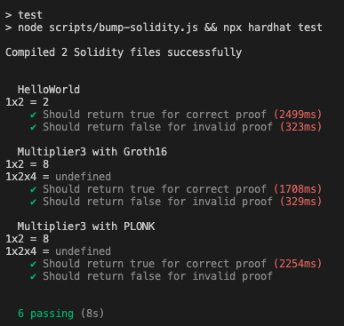

# [solution] Week 1

Email: paolo@luduvigo.com – Discord: luduvigo#5507

Code solution repo at: https://github.com/luduvigo/week1**

## Part 1

1. Groth16 and Plonk.

2. SNARKs rely on a common reference string (CRS) that was created using a trusted setup and that the keys generated are destroyed. This is because if someone is able to manipulate the CRS, they can generate false transactions.
3. STARKs are quantum resistant, since they rely on hash functions. SNARKs are not. SNARKs are more gas efficient. STAKs have a higher proof size.

## Part 2

2.  1.  It checks that the output is the multiplication of two inputs.

    2.  PowersOfTau ceremony is needed in Phase 1 of the trusted setup creation. This is important for zkSNARKs, because they rely on a Common Reference String as a public parameter, which must be generated in advance, to make the everything random and avoid data tampering.
    3.  The first phase creates the randomness for the ceremony,

3.  1.  Done.
    2.  The error "Non quadratic constraints are not allowed" arises because the circuit contains the constraint `d <== a * b * c` which is cubic, that is cubic instead of quadratic. Circom only allows for quadratic constraints.
    3.  Done.

4.  1.  The error encountered is "snarkJS: Error: zkey file is not groth16". This is because PLONK doesn't require a ceremony unlike Groth16. The `contribute` step is not needed and we can directly export the verification key.

    2.  Practical differences between Groth16 and PLONK include the need to provide the proof as bytes data directly to the verifier contract and the significantly slower execution time for PLONK proofs.

    3.  Below the tests output:

        

## Part 3

1.  1.  The 32 in line 9 is the number of bits that we expect as input for the LessThan.
    2.  The output is 1 if the input is less than 10 or 0 if it is equal or more than 10.
    3.  Done

2.  2.  Not sure if I got it, it worked but I don't know if it is the correct way to do it.

    3.  The benefits of an algorithmic solution include the smaller computational footprint of the verification and the ability to run this computation pragmatically inside a smart contract.

3.  [bonus]
4.  [bonus] I think that there is plenty of space for new libraries. For example, having circuits for Algorithms like Ford-Fulkerson and Kruskal's algorithms should be interesting.
